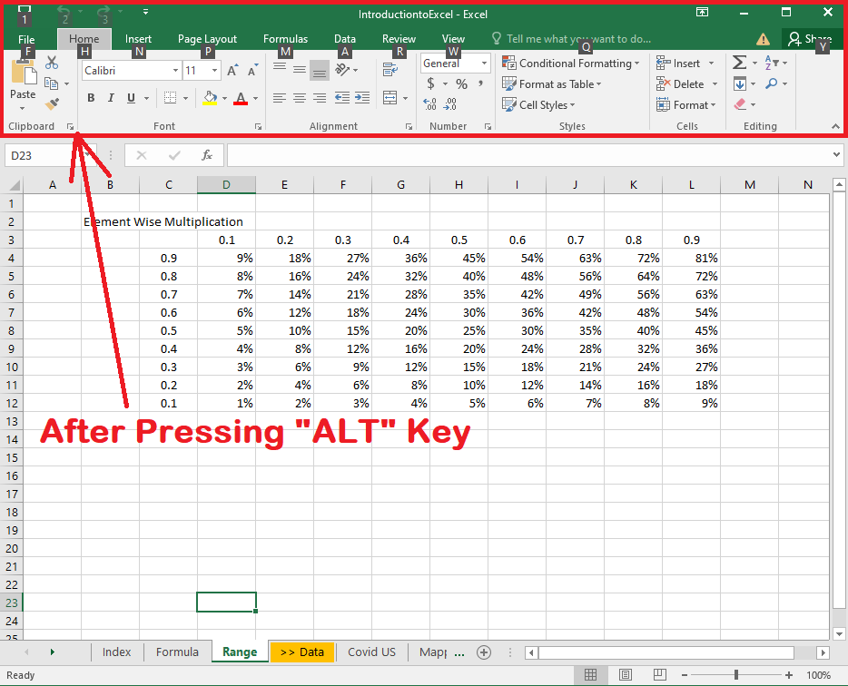
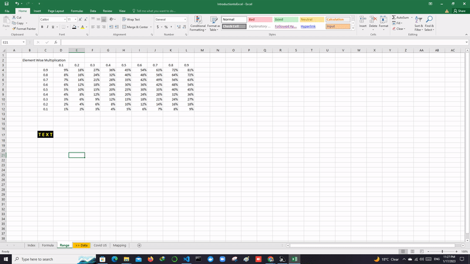

# DATA EXPLORATION using EXCEL - Excel Introduction

## Excel : 
- It is one of the spreadsheet software.

## Spreadsheet: 
- It is the **combination of horizontal lines - rows and vertical lines - columns**.

## Uses of Excel:

- Excel is one of the most widely used, software tool in industries.

### Previous Uses or Initial Phase:
- It is primarily used for calculations purpose.

### Present day use of Excel :
- Now, it is used by most of the Data Analysts, Data scientists, and others who relate to Data Analytics.

- Now, we can use Excel fo                                                                       r various purposes like **some calculaions, Visualization and any analysis insights using charts and other graphs,** even it replaces powerpoint presentation for many developers.
<hr>

## 1.  Workbook: 
- Any file that you **open (or) create within Excel** is called a workbook and it **contains multiple spreadsheets**.

- It is a top level collection sheets in Excel.

- They are used and also a **popular way to store, organized and, analyze data, and they are widely used in many different industries**. 


## 2. Worksheet:
- An Excel worksheet ( or a sheet ) is a **single page in an workbook**.

- **A sheet in a workbook is like empty canvas** where you can enter and manipulate data, create charts and graphs to perform visualization.

## 3. Cells :
- Each **combination of specific row and column** or when row and column used as coordinate values to locate any position on a sheet. 
**(row=Numerical_value (1, 2, 3, ...), column=Alphabetical_values (A, B, C, ...))**

- Grid line A1, A2, A3, ... B1, B2, B3, ... C1, C2, C3, ... D1, D2, D3, ... E1, E2, E3, ... F1, F2, F3, ... G1, G2, G3, ... etc.,

## 4. GOTO statement :
- The **GOTO statement is a control statement** in Excel that allows you to **jump to a specific cell (or) range of cells** within a worksheet.

> Note : GOTO statement is "Legacy" statement in Excel and it is generally not recommended for use in modern excel sheet instead, of using GOTO statement, you can use if-else.

### KEYBOARD SHORTCUTs :

1. To show shortcuts on ms-excel hit ```ALT``` and you can see short over the excel file.
<br>

After Hitting ```ALT``` key :



2. **Copy & Paste** : Use the combination of key ```CTRL + C ``` for coping and for pasting ```CTRL + V``` and their are different ways to paste:
<br>
        (i) For pasting only the value of the cell not it's format we have options.



<br>

## GOTO Statement and Shortcut : 

- The **GOTO statement is a control statement** in Excel that allows you to **jump to a specific cell (or) range of cells** within a worksheet.

- For using **GOTO statement**, the shortcut keywords are ``` CTRL + J ``` and then enter the specific cell rows and column location like A1, A2, A3, .. or G8 etc., 


## 4. Inserting a Row/Column :
<br>

- To insert a row in spreadsheet, the shortcut keywords are ```CTRL + ALT + = + R``` 

- for inserting a column in spreadsheet, the shortcut keywords are ```CTRL + ALT + = + C ```

<br>


## 5. Deleting a Row/Column :
<br>

- To delete a row in spreadsheet, the shortcut keywords are ```CTRL + ALT + - + R```

- for deleting a column in spreadsheet, the shortcut keywords are ```CTRL + ALT + - + C ```

<br>


## 6. Decimal Number to Percentage Convertion :
<br>

- To **convert decimal number to percentage value excel provide shortcut keywords** these are 
```CTRL + SHIFT + 5``` as show in this gif file.

<br>


## 7. To move from bottom-most to top-most cell, or selecting whole worksheet : 
<br>

- To move from bottom-most to top-most cell, the shortcut keywords are ```CTRL + UpArrowKey(```&#x2191;```)``` 


<br>

# Formating


 