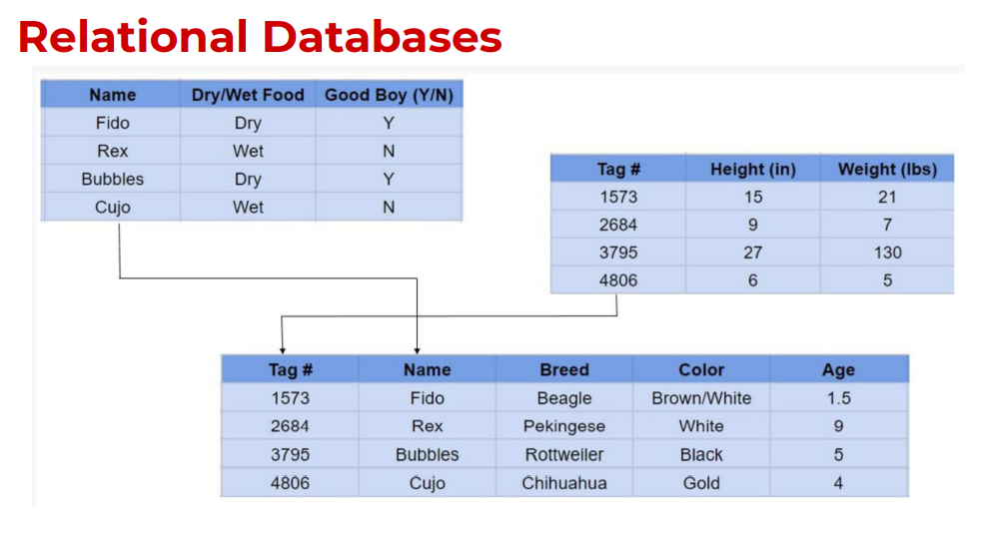

# SQL Fundamentals

## Relational Databases :

- A relational database is one that **stores data in tables .** The relationship between each data point is clear and searching through those relationships is relatively easy, **The relationship between tables and field types is called  a scheme.** For relation databases, the schema must be clearly defined.

 

 

## Non - Relational Databasea : 
 

- A non-relational database is any database that **does not use the tabular schema of rows and columns** like in relational databases. Rather, **its storage model is optimized for the type of data it's storing.**

- They also known as **NOSql Databases** where **NOSql** stands for "**N**ot **O**nly" **Sql**.

<table>
  <tr>
      <th></th>
      <th> There are four different types of NoSQL databases. 
        
    
    Document-oriented databases –
    
    Also known as a document store,
    this database is designed for
    storing, retrieving and managing 
    document-oriented information.
    
    Document databases usually pair each 
    key with a complex data structure 
    (called a document).

    Key-Value Stores – 
    
    This is a database that uses 
    different keys where each key
    is associated with only one value 
    in a collection. Think of it as a 
    dictionary. This is one of the simplest
    database types among NoSQL databases.

    Wide-Column Stores – 
    
    This database uses tables, rows, 
    and columns, but unlike a 
    relational database, the names and 
    format of the columns can vary from
    row to row in the same table.
    
    
    Graph Stores – 
    
    A graph database uses graph structures
    for semantic queries with nodes, edges,
    and properties to represent and store data.

  </th>
  </tr>
</table>

What kind of Database should we choose?

How to choose a DB?

1) What type of data will you be analyzing?

- Ans : We have to **encounter what's the nature of Data to be stored.** firstly, **if DB has rows and columns (strutured Data) then we can go with relational Data base**, and **if DB has data more flexible like images, video, etc., (un-structured Data) then we move to NoSQL DB**.

2) How much data are you dealing with?

- Ans : Suppose I have millions or billions of data (rows and columns), rule of thumb, is the **bigger the dataset More likely, we should go with NoSQL database** to store it. Because **NoSQL database can store a limited sets of data and, has flexibility, to change the data type** and, store it in the database. whereas in relational databases **we have to do multiple and intensive read and write operations on the database, this might increase the traffic between the Database and Applicaion and slows-down the entire process**.

3) What kind of resources can you devote to the
setup and maintenance of your database?

- Ans : Kind of resourses (talking about man-power) so, suppose there a team of Data Scientists (20 - 40 people) are working together and some are from various domains like some are statistians, some are chemists, some are from engineering background but all are working and devouting their time to solve the real-life problems.  

4) Do you need real-time data?

 
