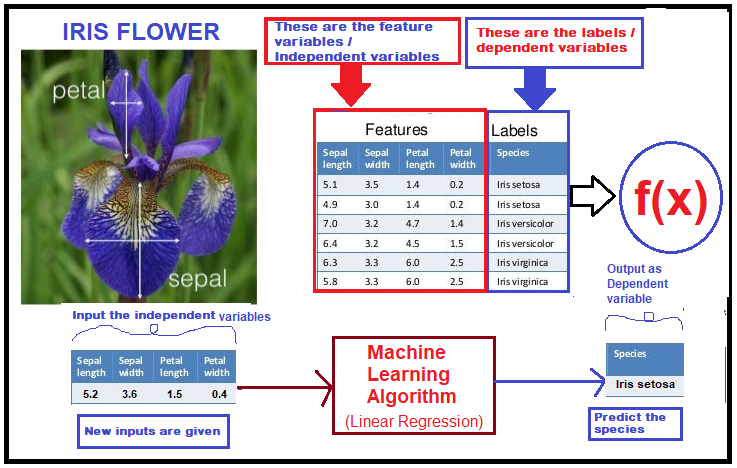

# Linear Regression:

## Introduction :

- 1. For Linear regression (or) specifically, for any supervised machine Learning Algorithm we must requires two things:

     - **a) Feature variables/independent variables/predictor variables**, these are like regular variables which are attributes of labels.

      - **b) Target variables/Dependent variables/class lables**, it is like a "Source of Truth" - use for learning a pattern (or) giving knowlegde/information about the variables to the Algorithm.

    for example, Iris dataset having independent variables ['sepal Length', 'sepal width', 'petal length', 'petal width'] and, dependent variables (or) class labels ['Iris setosa', 'Iris Versicolor', 'Iris virginia']
      

  

  - 2. Linear Regression consists of predictor variable and dependent variable related linearly to each other. These can be expressed in terms of a straight line and we can find out the relationship between independent variable and dependent variable.

##  y = mx + c (it's a line equation)

where y is the line, m is the slope, c is the y-intercept.

but in Linear Regression,

 Y = θ0 + θ1X +  ε 

where,

θ0 :  is the y-intercept (or) c

θ1 : is the slope (or) m

ε : is the error 